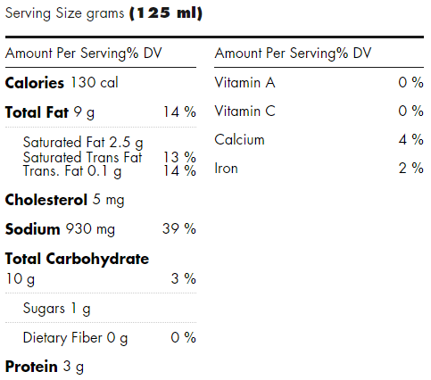

# Introduction

My diet was lacking a bit in flavour, so I finally decided to use one of my condensed cream of mushroom soups that I bought for sale a few weeks ago. I've wanted to resist the urge for as long as possible, as I know it probably isn't the healthiest of things.

# The Suprise

Being being the newly nutrition-focused person that I now am (last week I literally computed the protein-calorie-price ratio of all the dried beans at no Frills), I took a look at the nutrition label.

I was surprised to see that the sodium content was 930 mg / 39% of the daily value per 125ml serving. These were 284 mL cans!! Firstly, I don't think anyone is using half of the can and saving it for later. Therefore that's 88.608% of the daily value per can, or 2112.96 mg of sodium per can. That's nuts.

Looks like I won't be buying that anytime soon.

# Cool Videos

- [Healthy or junk food? Busting food labels (CBC Marketplace)](https://www.youtube.com/watch?v=kUKOt_SvTQc)
- [10 "healthy" food labels, exposed (CBC Marketplace)](https://www.youtube.com/watch?v=opwBw-O_UaY)

# Moving Forward

On a side note, I've discovered that greek yogurt taste good with pretty much anything (ontop of seared chicken and as a dip for bread). Given it's relatively high protein, I might starting eating a lot more of it. I also want to avoid some of the processed sauces, so some things on my list will be:

- Canned diced tomatoes for pasta sauce (hopefully sodium free)
- Kirkland Signiture Pesto (according to reddit it's pretty good)

Any other suggestions?

# Side Note on No Frills Baguettes

The "Harvest Wheat Baguette" has enriched wheat flour as it's third ingredient... At least they say it's only 60% whole wheat. Tastes good tho.
