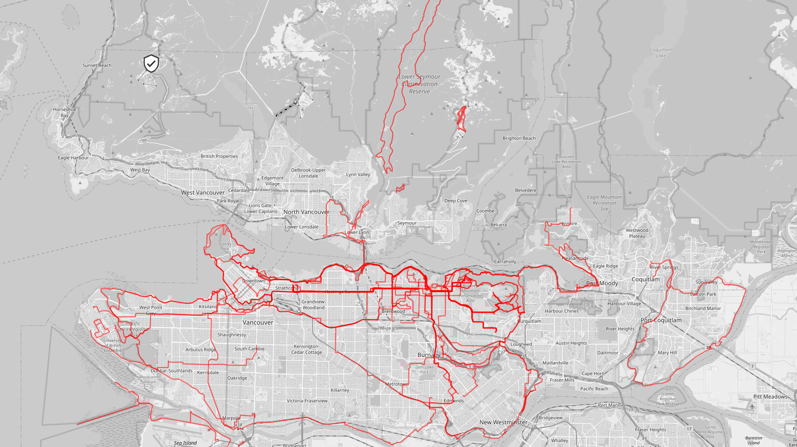
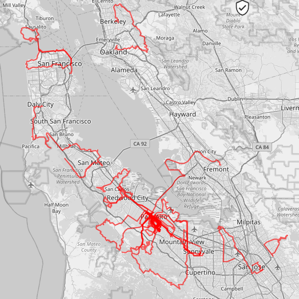
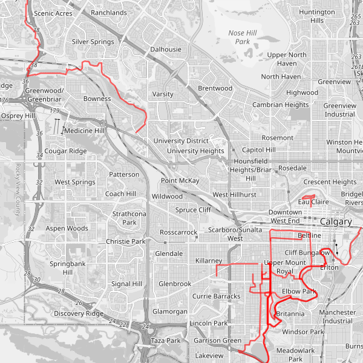
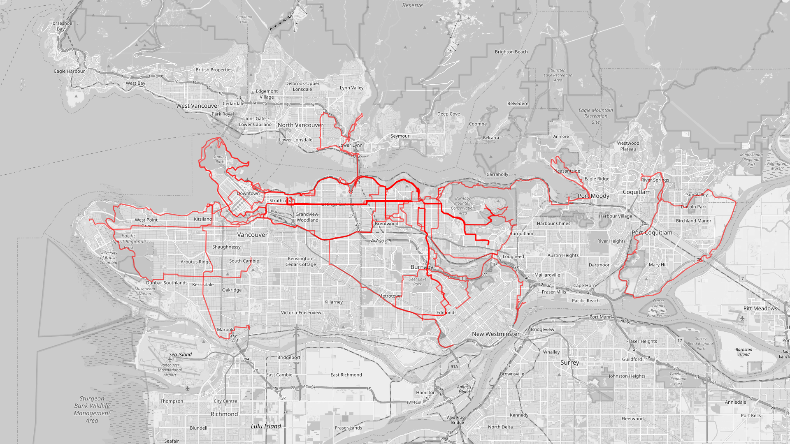
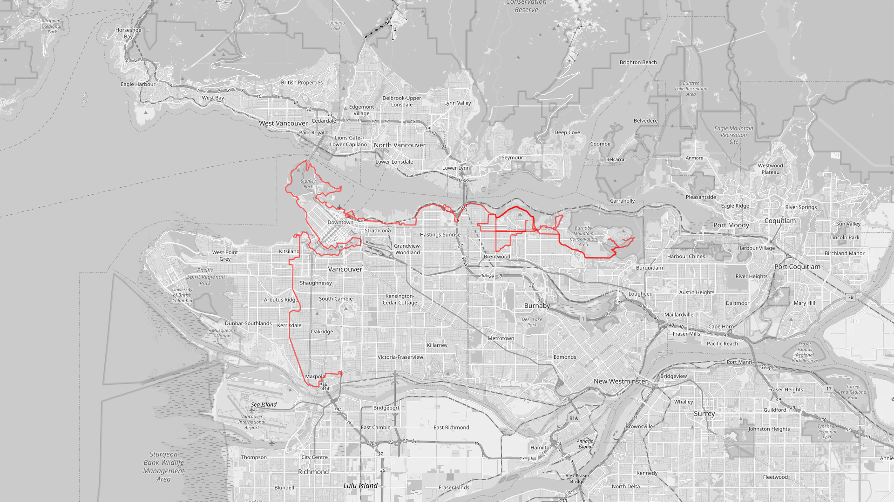

Here are my Strava heatmaps across the years, courtesy to [Statshunters](https://www.statshunters.com/).

## 2025 April

Longer bike rides, did trail jogging around SFU.

## 2024 September

Biked around the bay area during my internship at Tesla. Find out more [here](../palo-alto-adventure).

## 2024 April

Mostly running around Calgary, plus a stint on a longboard -- during AMD internship.

## 2023 April

Mostly biking, the dark lines were from biking to work (Brave Technology) in East Van.

## 2022 May

First rides few rides on a Northrock XC27 :). I wrote about that long ride [here](../vancouver-bike-tour).

