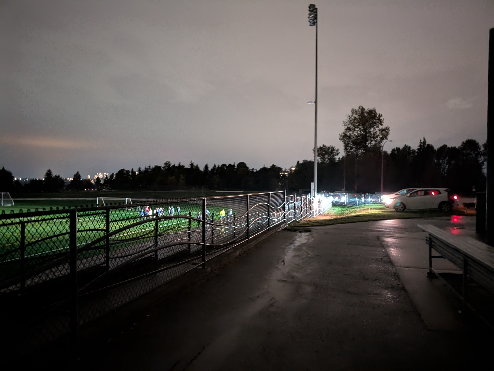

There was a power in my neighbourhood from 4:15 pm till 9:30 pm. Today also happens to be the National Day for Truth and Reconciliation. Did you know that most non-BC provinces don't have this as an statuary holiday? This also meant that the response time was likely to be slower than usual.

## Traffic "Lights"

On my way to/from the gym, there was an intersection with the traffic lights off. Now, in BC, we learn that a flashing red means to treat the intersection as a stop sign, but without power, the lights were completely off. There were quite a few close calls, where people were speeding through the intersection, as-if they had the right of way.

This made me want to think of potential solutions. One thing that came to mind is the the [Dead man's switch](https://en.wikipedia.org/wiki/Dead_man%27s_switch). What if there was an electrically powered stop sign, that is usually angled up at the sky. Then if the power goes out, gravity will bring it down, covering the usual traffic light. Hopefully better indicate that this intersection is to be temporarily treated as a stop sign. Re-arming this system may have to be manual, or require costly pneumatics.There's also a cost-benefit trade-off, between safety and how often power outages happen.

## Soccer in the Dark?

I took a stroll around. It's quite rare to be in a urbanish area and to have minimal light pollution. Unfortunately the sky was overcast, so I couldn't see any stars. Nonetheless, I did pass across a little-league soccer clinic of sorts happening. The parents/guardians drove their vehicles onto the grass flaking the soccer field, had their headlights on full blast, illuminating a huge chunk of the field. Quite clever! I'll definately remember this if I ever need to do something similar.

## Power Outage Preparation

Having a good amount of light sources is always nice to have! The amount of redundancy I had was quite comforting:

- Phone (with power bank)
- Headlamp
- Watch

Granted, my power bank and headlamp were not fully charged. Perhaps I should stay on top of that. There should also be flashlights somewhere at home, but I have no clue where -- this should be remedied, especially as preparation for more critical emergencies. For power outages, I can always walk across the road to the Tim Hortons, or drive to the 24-hour MacDonald's.
