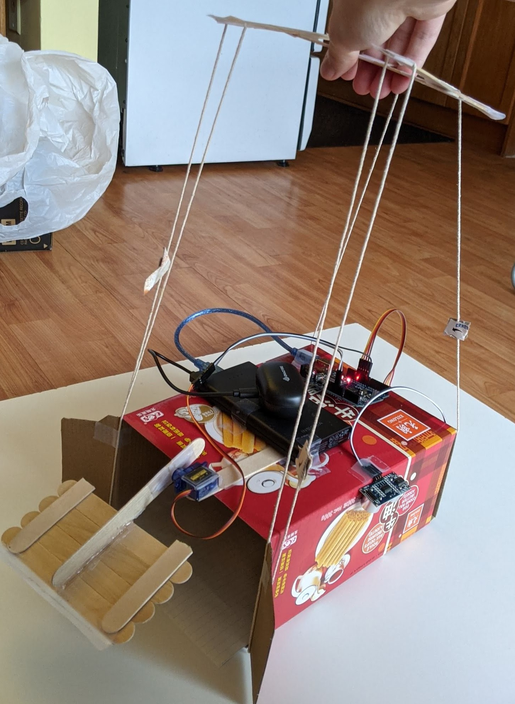

[**Video of moving items**](https://www.youtube.com/watch?v=DB-3DKZoBs8)

We were challenged to design and build an autonomous claw to pick up an series of objects. We were only allowed to hold the claw via a marionette-controller-style handle. A ultrasonic sensor detects the location of the 'claw' from the floor to figure out when to open/close it. My design successfully picked up all the required objects!
