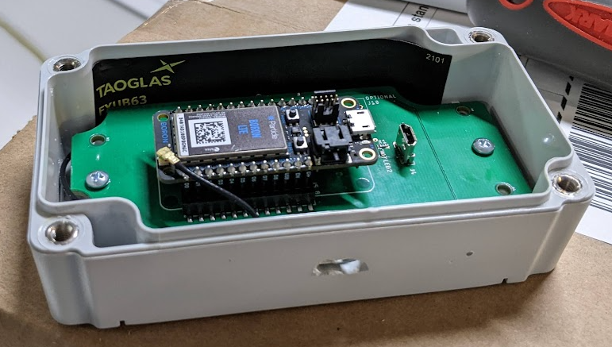

# Internship at Brave Technology Cooperative

Brave is a company that makes overdose detection tools to improve awareness and save lives. I worked on the as a firmware developer, working mainly on the Brave Sensor, with minor work on the Brave Button and Particle Accelerator.

## Brave sensor

[**Github Repository**](https://github.com/bravetechnologycoop/BraveSensor)\
I worked on improving reducing the BLE scan misses of the firmware, by using the updated Particle BLE api. Additionally, assisted the main software developer in the deployment of firmware updates (via Particle OTA Firmware updates).
Challenges:

- Statistics showed that sometimes the Brave Sensor would miss door opening/close messages sent by our door sensor. We thought that the most likely cause was that there is gaps in our BLE scanning. Therefore, I had to figure out how to use the updated Particle BLE api more efficiently scan for device, to minimize the gaps.

### Lora Brave Sensor

[**Github Repository**](https://github.com/bravetechnologycoop/LoraBraveSensor)

One of the methods that the lead engineering came up with in terms of improving the adaptability of the Brave Sensor, was to make it battery powered. Given that the original device used cellular for IoT, we had to transition to a lower-power solution. We decided to use LoRaWAN, which is a low-power wide-area network, as customers using the Brave Buttons would already have a LoRaWAN gateway. Therefore, I was tasked with refractoring the firmware to work on the RAK3272S Breakout Board chip, as a stand-alone device. \
Challenges:

- The RAK3272S Breakout Board chip is a LoRaWAN device, and not a cellular device. Therefore, we had to find a way to get the device to connect to the LoRaWAN network. I had to do a lot of research regarding the LoRaWAN protocol, and how to connect to the network. I also [posted](https://forum.rakwireless.com/t/connecting-rak3172s-breakout-board-to-aws-iot-for-lorawan/7366) on the RAK forums, and got a lot of help from the community.
- With the new microcontroller hardware, the system api changed. Therefore, I had to [figure out how to use the flash memory](https://forum.rakwireless.com/t/saving-data-to-flash-on-rak3272s/7493), and how to use the RAK RUI system api.
- Since we wanted this device to be battery powered, I had to [figure out how to use the battery-saving modes of the chip](https://forum.rakwireless.com/t/rui3-wake-on-interrupt/7460), and distinguish between the critical and non-critical operations of the system. Most of the state machine had to be rewritten to encorporate states that allow for the device to go into sleep mode. Additionally, had to add hardware timers for the device to wake up at a specific times based on the state of the device.

## Brave Sensor Client Demo Device

[**Front-end (data is updated every second when device is active)**](https://sensor-demo.brave.coop/)

In hopes of making it easier for us to demo the device to potential customers, I was tasked with refractoring the firmware to run on a ESP32, so that we can use WiFi to cheaply send data to an AWS backend. I was also responsible for creating a front-end web app that visualized the data collected by the Brave Sensor, and showed how it worked. This was done using C++, AWS and html/css, for the firmware, backend, and frontend respectively.
Challenges:

- As this was my first time using AWS IoT, I had to first research the types of tools that it provided. I decided that using the MQTT protocol is sufficient for our needs. Additionally, I also had to figure out how to use the AWS IoT SDK for C++ to connect the device to the AWS IoT Core.
- I had to figure out how to use the ESP32's WiFi capabilities to connect to the internet. I also had to figure out how to use the ESP32's BLE capabilities to scan for the door sensor.
- I also had some minor hickups making the front-end, as I was new to real-time data visualization. I had to figure out how to use the AWS IoT SDK for Javascript to connect to the AWS IoT Core, and subscribe to the MQTT topic that the device was publishing to. I also had to figure out frameworks for the data visualization, and how to smoothly and periodically update the data.

## Brave Buttons

The old provisioning process required a lot of manual labour, by using the (shitty) tools provided by the manufacturer of our LoRaWAN buttons to update the firmware settings to our liking. There was also a bit of overhead in getting the EUI from the device, and adding it to our AWS IoT Core for LoRaWAN. My solution to this was to create an [autohotkey script](https://github.com/bravetechnologycoop/BraveButtons/blob/main/ops/rak_button_firmware.ahk) to do all of the tasks on the computer automatically. The only point humans had to intervene was to connect/disconnect the buttons, and to press the button to enter the firmware update mode. Overall, this significantly improved our efficiency in provisioning the buttons.

## Particle Accelerator

Minor typo fixes and documentation updates.
