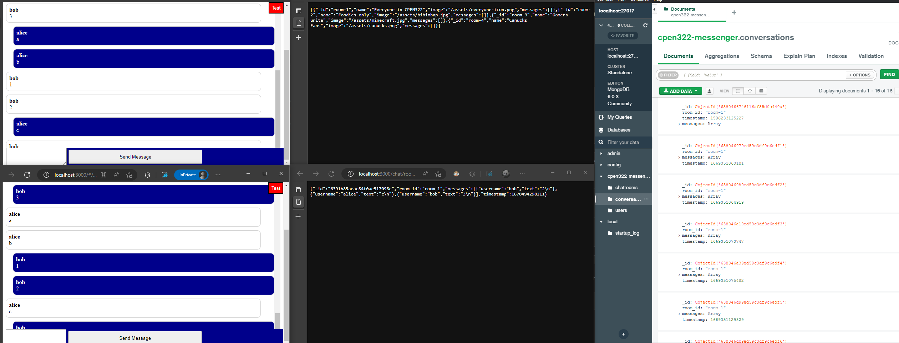

# Summary

A basic chat app using modern web technologies without JS frameworks

## Key Takeaways

- Using routing to create a single-page application
- Updating application state by following a model-view-control pattern
- Implement a server that can handle multiple clients using AJAX requests and websockets
- Using a nonSQL database to store data, and creating a REST API to access it
- Implement a authentication mechanism using session cookies
- Prevent cross-site scripting attacks by sanitizing user input
