Projects from my CPSC 425 computer vision class.  
Implementations are done with minimal use of higher-level computer vision or ML libraries.

[Image Filtering and Hybrid Images](#image-filtering-and-hybrid-images)  
[Scaled Representations, Face Detection, Image Blending](#scaled-representations-face-detection-image-blending)  
[Texture Synthesis](#texture-synthesis)  
[RANSAC and Panorama Stiching](#ransac-and-panorama-stiching)  
[Scene Recognition with Bag of Words](#scene-recognition-with-bag-of-words)  
[Deep Learning](#deep-learning)

# Image Filtering and Hybrid Images <a name="image-filtering-and-hybrid-images" />

Creating Hybrid images using open-cv and numpy.

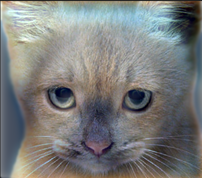

# Scaled Representations, Face Detection, Image Blending <a name="scaled-representations-face-detection-image-blending" />

## Face Detection

Face detection with template matching using open-cv and numpy.

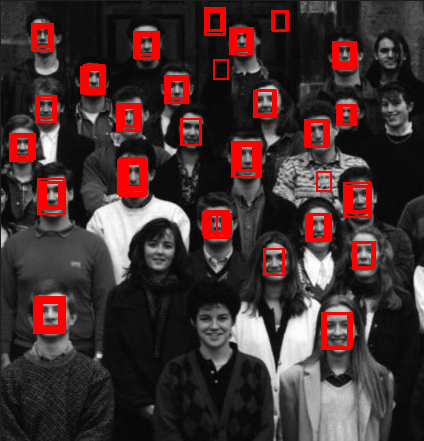

## Image Blending

Image blending using laplacian and gaussian pyramids using open-cv and numpy.

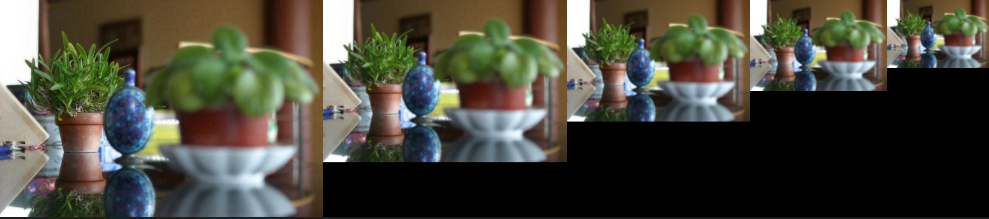

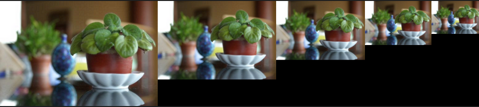

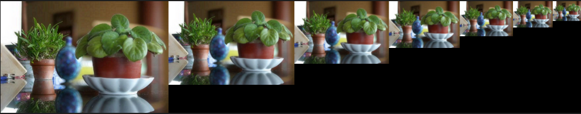

# Texture Synthesis <a name="texture-synthesis" />

Wrote the a texture synthesis function based on Efros and Leung.

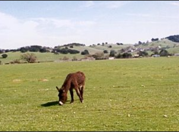

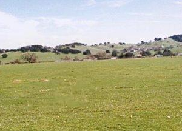

# RANSAC and Panorama Stiching <a name="ransac-and-panorama-stiching" />

Wrote functions for panorama stiching with RANSAC and SIFT using numpy.

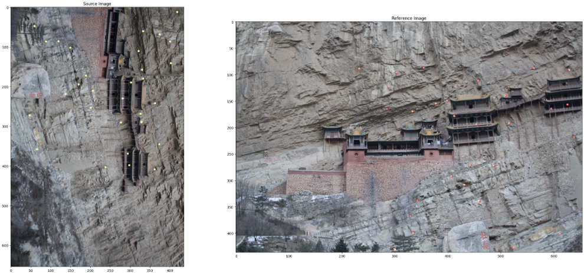

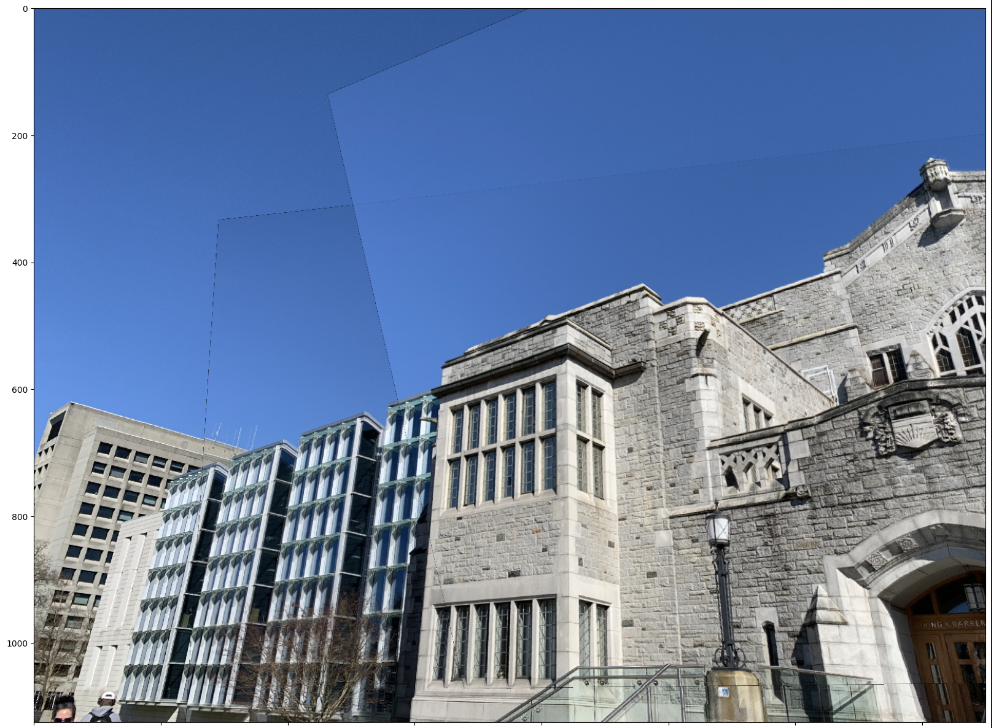

# Scene Recognition with Bag of Words <a name="scene-recognition-with-bag-of-words" />

Wrote functions for a KNN and SVM classifiers with numpy and sklearn.

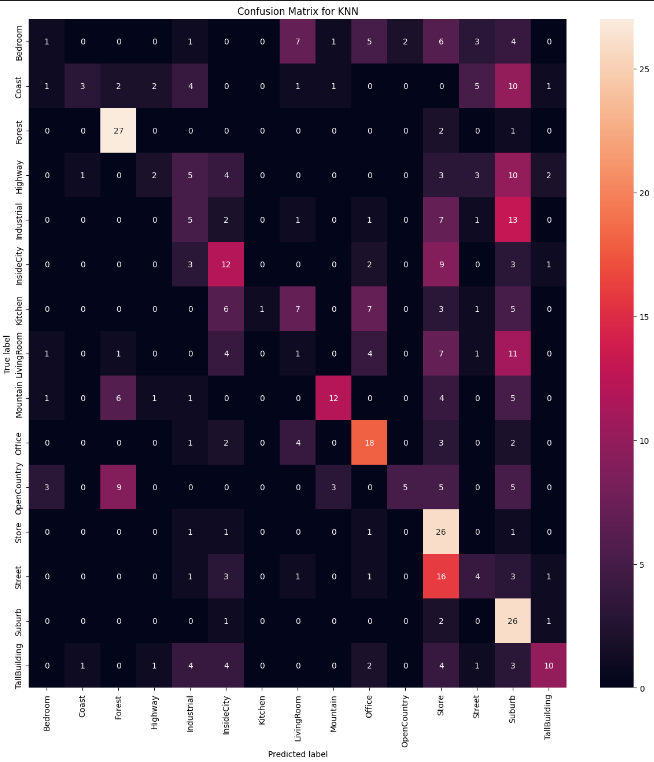

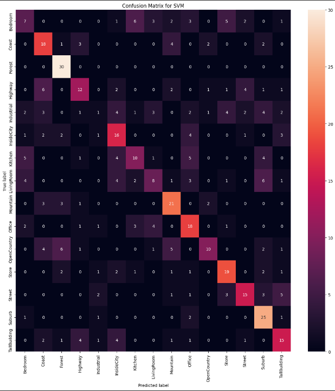

# Deep Learning <a name="deep-learning" />

## Image Classification

Tuned the hyperparameters of an CNN-based image classification.

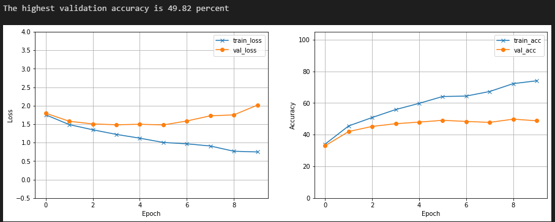

```
Net(
  (cnn): Sequential(
    (0): Conv2d(3, 16, kernel_size=(3, 3), stride=(1, 1))
    (1): ReLU()
    (2): MaxPool2d(kernel_size=2, stride=2, padding=0, dilation=1, ceil_mode=False)
    (3): Conv2d(16, 16, kernel_size=(3, 3), stride=(1, 1))
    (4): ReLU()
    (5): MaxPool2d(kernel_size=2, stride=2, padding=0, dilation=1, ceil_mode=False)
    (6): Conv2d(16, 64, kernel_size=(3, 3), stride=(1, 1))
    (7): ReLU()
  )
  (linear_layers): MLP(
    (model): ModuleList(
      (0): Linear(in_features=1024, out_features=16, bias=True)
      (1): ReLU()
      (2): Linear(in_features=16, out_features=16, bias=True)
      (3): ReLU()
      (4): Linear(in_features=16, out_features=10, bias=True)
    )
  )
)
```

## Image Segmentation

Experimented on the types of inputs Mask R-CNN will succeed and fail on.

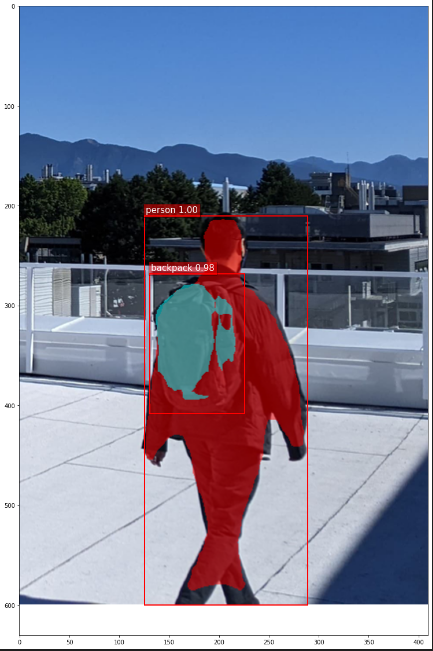

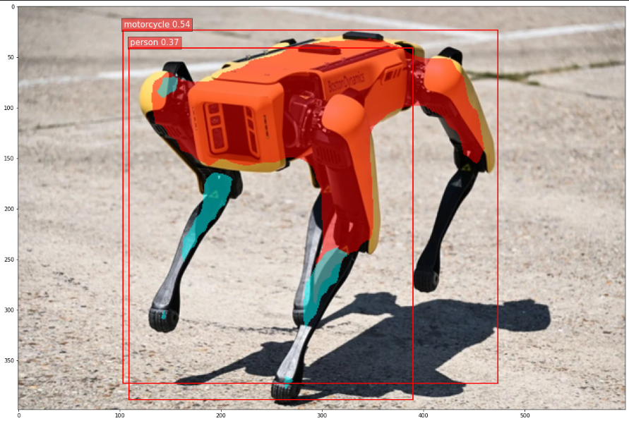

```
MaskRCNN(
  (transform): GeneralizedRCNNTransform(
      Normalize(mean=[0.485, 0.456, 0.406], std=[0.229, 0.224, 0.225])
      Resize(min_size=(800,), max_size=1333, mode='bilinear')
  )
  (backbone): BackboneWithFPN(
    (body): IntermediateLayerGetter(
      (conv1): Conv2d(3, 64, kernel_size=(7, 7), stride=(2, 2), padding=(3, 3), bias=False)
      (bn1): FrozenBatchNorm2d(64, eps=0.0)
      (relu): ReLU(inplace=True)
      (maxpool): MaxPool2d(kernel_size=3, stride=2, padding=1, dilation=1, ceil_mode=False)
      (layer1): Sequential(
        (0): Bottleneck(
          (conv1): Conv2d(64, 64, kernel_size=(1, 1), stride=(1, 1), bias=False)
          (bn1): FrozenBatchNorm2d(64, eps=0.0)
          (conv2): Conv2d(64, 64, kernel_size=(3, 3), stride=(1, 1), padding=(1, 1), bias=False)
          (bn2): FrozenBatchNorm2d(64, eps=0.0)
          (conv3): Conv2d(64, 256, kernel_size=(1, 1), stride=(1, 1), bias=False)
          (bn3): FrozenBatchNorm2d(256, eps=0.0)
          (relu): ReLU(inplace=True)
          (downsample): Sequential(
            (0): Conv2d(64, 256, kernel_size=(1, 1), stride=(1, 1), bias=False)
            (1): FrozenBatchNorm2d(256, eps=0.0)
          )
        )
...
      (relu): ReLU(inplace=True)
      (mask_fcn_logits): Conv2d(256, 91, kernel_size=(1, 1), stride=(1, 1))
    )
  )
)
```
