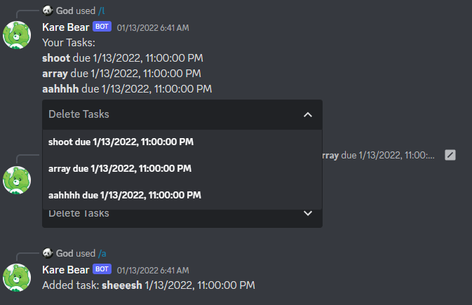

[**Repo**](https://github.com/WorldofKerry/Kare-Bear)

- Written in Node.js and uses Firebase Firestore for storing user data
- Scrapes the UBC website for course registration information
- Has an integrated todo list with smart input parsing
