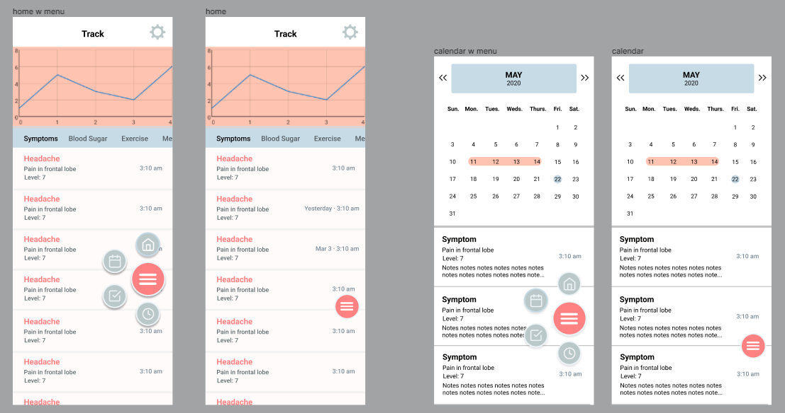

[**Repo**](https://github.com/WorldofKerry/Medicare)

- Java Android app to make it easier for diabetics to keep track of their medical needs
- Responsible for designing portions of the app using Figma, and developing various activities
- Won the Best Designed App award for the New Westminster cohort
