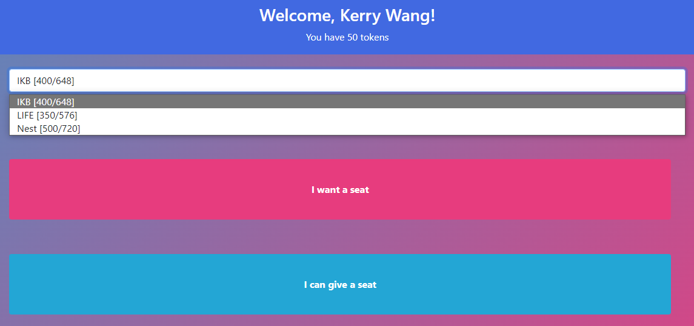

[**Repo**](https://github.com/Haxrox/sitdown) and [**Demo**](https://nwhacks-sitdown.web.app/)

Web app to handle the massive amount of traffic to UBC study areas.
• Created a seating reservation system using React.js, Bootstrap, Firebase Auth, Firestore and Hosting
• Handled the user authentication, server requests and portions of the user interface
