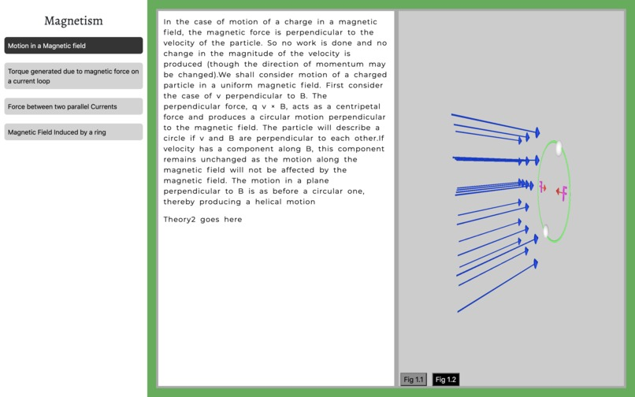

[**Repo**](https://github.com/WorldofKerry/Xperiment.3D_HTML)

- A teaching tool that delivers science material through interactable 3D models
- Designed and developed the front-end portion of the web app using Bootstrap
